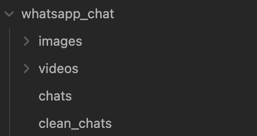

# Obsidian Whatsapp Backup Importer

This is a custom plugin for [Obsidian](https://obsidian.md) that allows you to import exported WhatsApp chat archives (in .zip format) into your vault. The plugin extracts and processes all chat messages, attachments (such as images and videos), and places them neatly inside a folder of your choosing, complete with links to the attachments.

## Features

- **Chat Import:** Extracts messages from a WhatsApp chat export (in `.zip` format) and imports them into your Obsidian vault.
- **Attachment Handling:** Automatically imports photos and videos attachments from the chat and creates appropriate links within the chat files.
- **Customizable Output Folder:** You can specify where in your vault the imported chats and attachments should be stored.

## Installation

To install the plugin, follow these steps:

1. Download the latest release from the [Releases](https://github.com/LuigiCerone/obsidian-whatsapp-backup-importer/releases) section.
2. Place the plugin folder into the `.obsidian/plugins` directory of your vault.
3. In Obsidian, navigate to `Settings -> Community Plugins`, enable the plugin, and reload Obsidian.

## How to Use

1. **Export WhatsApp Chat**: From your smartphone or computer, export the chat you want to import as a `.zip` file. This zip file should contain a `.txt` or `.json` file for the messages and any attachments (images, videos, etc.).
   
2. **Open Command Palette**: In Obsidian, press `Cmd + P` (or `Ctrl + P` on Windows/Linux) to open the command palette.

3. **Run the Plugin**: Search for the command `WhatsApp backup importer: Open Whatsapp backup importer`. Select it and run.

4. **Input Required**:
   - **Output Folder**: Enter the folder within your vault where you want to store the chat.
   - **ZIP File**: Select the `.zip` file that contains the exported WhatsApp chat archive.

5. **Importing**: The plugin will automatically extract the messages and attachments from the `.zip` file and place them in the specified output folder.

6. **Check the Imported Files**: You will find the imported chat as markdown files, with links to attachments. All media will be stored in subfolders, and the corresponding links to those files will be embedded in the markdown files.

## Example

After importing a WhatsApp chat, your folder structure might look like this:

## Compatibility

- Obsidian 1.0.0 or higher
- Tested on Windows, macOS, and Linux

## Contributing

Contributions are welcome! Feel free to submit a pull request or report issues.

1. Fork this repository.
2. Create a branch (`git checkout -b feature/your-feature`).
3. Commit your changes (`git commit -am 'Add your feature'`).
4. Push to the branch (`git push origin feature/your-feature`).
5. Open a pull request.

### How to run

- Clone this repo.
- Make sure your NodeJS is at least v16 (`node --version`).
- `npm i` or `yarn` to install dependencies.
- `npm run dev` to start compilation in watch mode.

## Known Issues

- Ensure that the WhatsApp export is in `.zip` format and contains the required chat messages and attachments. Other formats are not be supported.
- If attachments are not linked correctly, check that the file names in the `.zip` match those referenced in the chat export.
- If the chat contains image with caption, the caption's text is not exported in the `.zip` file if running on iOS but only in Android.

## License

This project is licensed under the MIT License. See the [LICENSE](LICENSE) file for details.

---

If you encounter any bugs or have suggestions for new features, feel free to open an issue or contribute!

